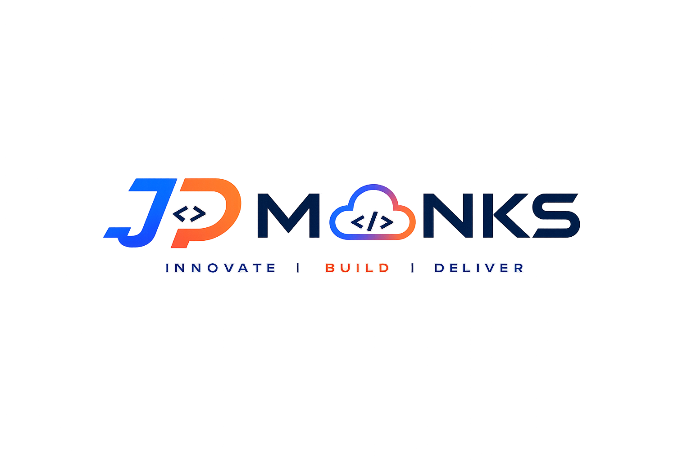

<p align="center">
  
</p>

<h1 align="center">JP Monks</h1>

<p align="center">
  <strong>Elite corporate technology platform and high-performance software architecture.</strong>
</p>

<p align="center">
  <a href="#-tech-stack">Tech Stack</a> •
  <a href="#-key-features">Key Features</a> •
  <a href="#-local-setup">Local Setup</a> •
  <a href="#-design-philosophy">Design Philosophy</a>
</p>

---

## Introduction

JP Monks is a premium corporate marketing platform engineered for modern enterprise systems, robust campus ERP suites, and financial trackers. 

Designed with absolute visual precision, the platform couples a high-fidelity cinematic UI with a lightweight, decoupled frontend architecture to ensure instant load speeds and zero-friction interactions.

---

## ⚡ Tech Stack

* **Vite** — Ultra-fast frontend tooling and bundle optimization.
* **Tailwind CSS v4** — High-performance utility-first styling engine.
* **Vanilla JavaScript (ES Modules)** — Zero-dependency, framework-free script modularity.
* **PostCSS** — Next-generation CSS compilation.

---

## ✨ Key Features

* **Instant Rendering** — Ultra-low perceived latency with zero runtime framework overhead.
* **Premium UI Elements** — Apple-inspired spacing, curated HSL color schemes, and glassmorphism headers.
* **Modular Architecture** — Decoupled directory layout with dedicated components, utility classes, and page sections.
* **Sleek Micro-Animations** — Passive `IntersectionObserver` scroll reveals and real-time statistics count-ups.
* **GPU-Optimized Performance** — Smooth mobile drawer transitions and hardware-accelerated scroll spies.

---

## 📁 Directory Structure

```markdown
JP-MONKS/
├── public/
│   └── assets/
│       └── logo/               # Standardized brand assets (PNG/SVG)
└── src/
    ├── components/             # Reusable UI modules (Navbar, Footer, ContactForm)
    ├── sections/               # Modular page sections (Hero, WhyUs, Products)
    ├── utils/                  # Stateless business logic (animations, validation)
    ├── styles/                 # Tailwind main stylesheet and tokens
    └── main.js                 # Global application entrypoint bootstrapper
```

---

## 🛠️ Local Setup

```bash
# Clone the repository
git clone git@github.com:CodeSage4D/JP-MONKS.git
cd JP-MONKS

# Install dependencies
npm install

# Start the high-velocity development server
npm run dev

# Compile optimized production bundles
npm run build

# Preview production build locally
npm run preview
```

---

## 💎 Design Philosophy

* **Stripe-Inspired Grid Precision** — Clean containment, precise alignment gutters, and elegant interactive states.
* **Apple-Level Spacing** — Generous whitespace margins allowing layouts to breathe naturally without visual clutter.
* **Cinematic Minimal UI** — Curated dark-navy brand palettes, stark white contrasts, and rich glowing focal elements.
* **Human-Centered UX** — Fluid layouts that adjust gracefully across small mobile viewports and large desktop displays.

---

## 📝 Notes

* **Stateless Utilities**: All business-level validation and layout observers reside in `src/utils/` to maintain clean, side-effect-free code compliance.
* **Decoupled Future**: The decoupled modular architecture allows marketing assets to remain lightweight while providing easy integration paths for upcoming SaaS ERP suites.
